# Math with Turtley

Math with Turtley is a website game for children to practice adding numbers. 
It is aimed at children between 6 and 8 years old. For children who are under this age adult assistance is required. This website hopes to make addition both fun and educational. The website is child-friendly in the ways it interacts with the user. You can visit the site [here](https://gaborerdei.github.io/MS2/)

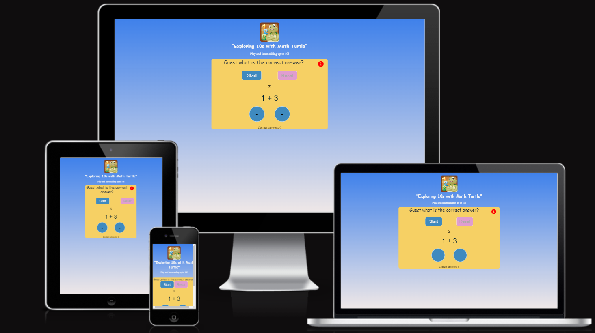

## Features 

- Math with Turtley Heading and Logo
    - At the top of the page, the Math with Turtley logo title and turtle logo image immediately let the user know that they're on a Maths website for children that has a game to play. 
    - The hint message below tells the user that he can add numbers to ten.

 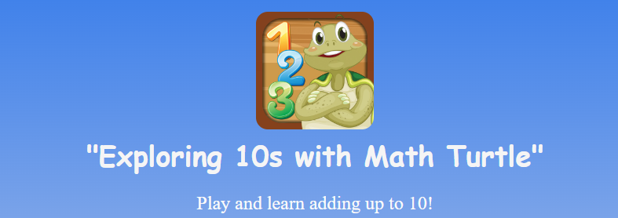
 
- Greeting and Log-in area
    - The greeting text from Turtley is presented at the main screen. Turtley asks the user to type his name. This is where the user can type his name or imaginary name. If user leave emty the name area, the his/her name will ba automatically "Guest".
    
 

- The Game Area
    - This is where the game will be played. It included multiple buttons: to start the game, reset the game, the game question, choose and submit their answer; operation area; and score area: current and high.
    - Before the game starts, the only button which is enabled and clickable is the start button. This encourages the user to click the start button and engage with the game content.
    - There is the rules button in the top right corner. The button is active before, during and after the game.

    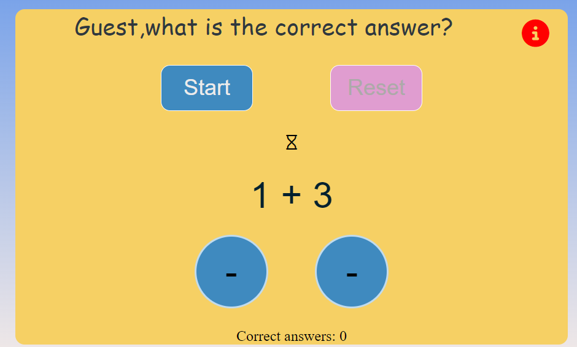
    
- Timer
    - The timer is triggered by clicking the Start button and can be reset at any point after then with the Reset button.
    - The Start button will be made disabled whilst the timer is running, so users cannot launch two timers at once. Two green answers buttons are active
    - The Reset button is disabled until the start button is clicked and can be clicked anytime whilst the timer is running.
    - Two answer buttons are active when the timer is running.
    - The timer interval is hidden from view until the Start button is clicked. At that point, the timer will start running and show below the Start and Reset buttons, next to the sandglass icon. The sandglass icon is on the screen all the time.

    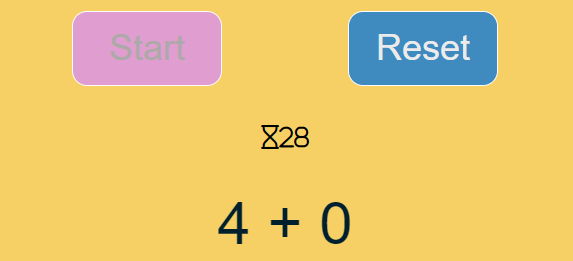
    
- Question area and Answer buttons
   - This is where the easy addition is displayed when the start button is clicked. The two random numbers are selected by displayQuestion function.
   - Two blue round buttons change the color to light green when hovered. This feature provides the user with good navigation and enables him to react fast to the question.
  
 

- The Score Section
    - The score will tally up the score of the player as they answer each correct answer.
    - This section shows the current score that the user has. The game gives 1 point for every correctly answered question.
    
    

 - Interaction: User name usage during the game
   - The user provides his name at the beginning of the website. The information of the name is saved and used on the game area as well as on the rules modal window to make a friendly atmosphere for the user.

  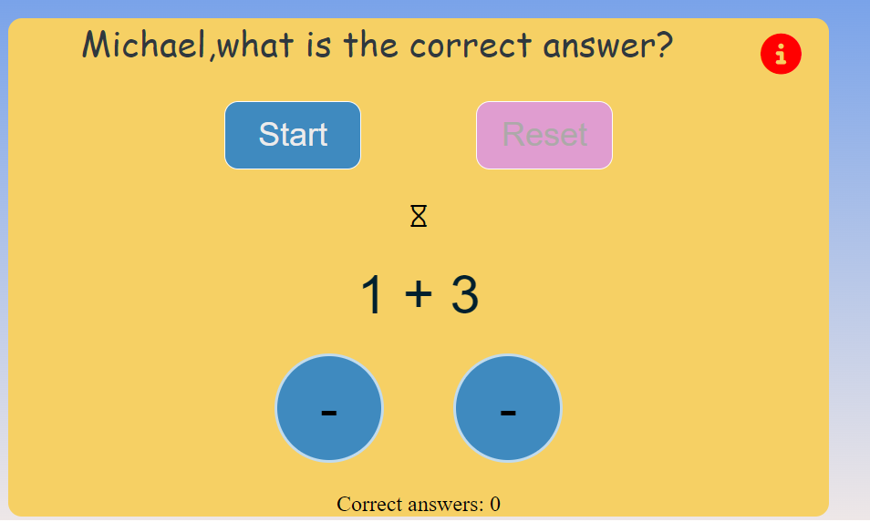

 - Interaction: Emoji as a reaction to a correct and incorrect answer
   - If the chosen answer is correct, the cool emoji appears; if the answer is wrong, crying emogy appears. This kind of interaction is very important for the child.
  
   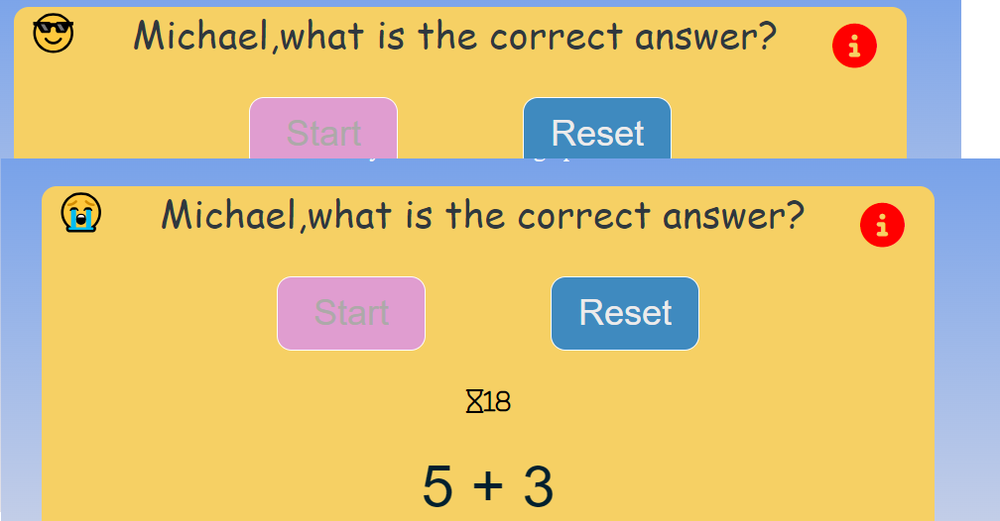

## Design

- The Design for this website was inspired by my doughter, who likes turtles and math. He is almost 5 and wants to learn to add numbers not only with the fingers. That is why I decided to make a game for her.
- This inspired me to make an interactive game where turtle plays with a kid. 

- The Colours throughout the website were chosen from the color palette I found on [Colorkit](https://colorkit.co/palette/00202e-003f5c-2c4875-8a508f-bc5090-ff6361-ff8531-ffa600-ffd380/) website. The process of picking colors was the nex: I chose a color from this palette and then played with its shades.

[Color palette](documentation/color-palette.png)

- Three colors are main:
   - Goldenrod
   - Marine Blue
   - Midnight Grey for the text color
  
---
## Testing
------
### **Validator Testing**

- I checked the website for responsive design, accessibility and performance on desktop browsers:
    - Chrome
    - Firefox
- I tested the website on Responsive Viewer for mobile, tablet and desktop screens browser Chrome.
- I tested also on my Oppo Find X5 phone Chrome browser.

 - **HTML**
   - No errors were found when checking the website with [W3C HTML Validator](https://validator.w3.org/) 

   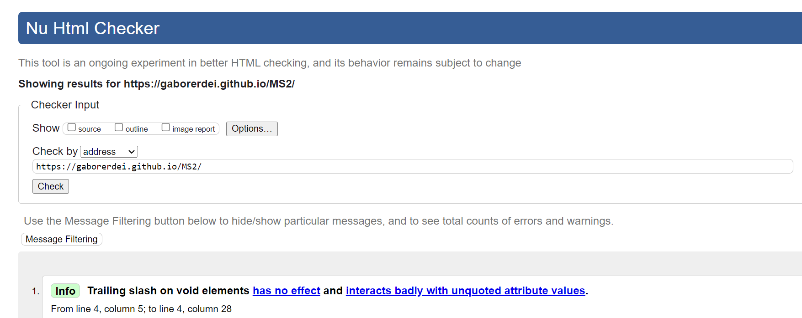
 
 - **CSS**

 - No errors were found when checking the website with [W3C CSS Jigsaw Validator](https://jigsaw.w3.org/css-validator/) 

   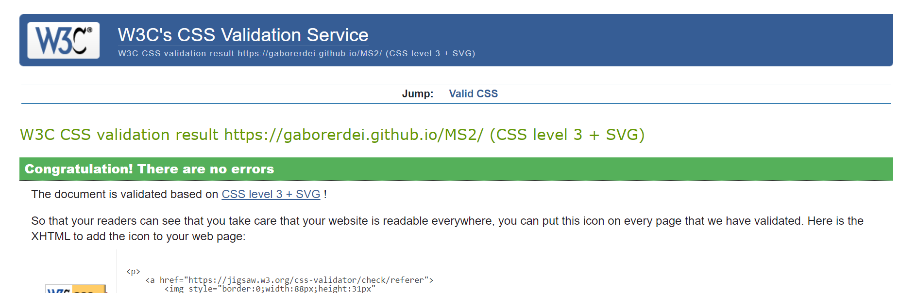
   
- **JS Hint**
- No errors were found when checking the JavaScript code using the [JS Hint](https://jshint.com/)
    - The metrics were as follows 
        - There are 12 functions in this file.
        - Function with the largest signature take 3 arguments, while the median is 1.
        - Largest function has 11 statements in it, while the median is 5.
        - The most complex function has a cyclomatic complexity value of 3 while the median is 1.5.
    - When testing my JavaScript with JS Hint, there were originally 17 warnings associated with it, however these disappeared when I added a section of code `/*jshint esversion: 6 */`  at the top of the document. This recommendation I have found in here https://stackoverflow.com/questions/54647294/const-is-available-in-es6-use-esversion-6
    - When I added `/*jshint esversion: 6 */` it was 0 warnings left:

    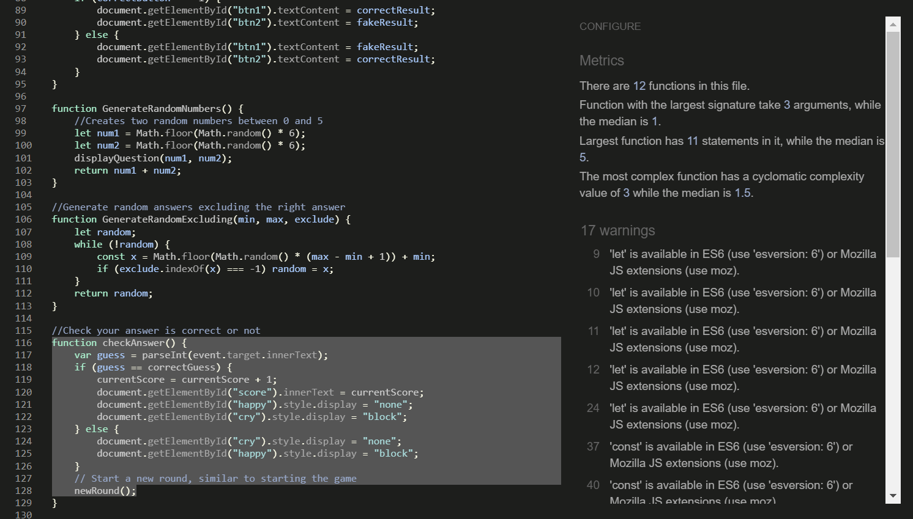
    - It was found 1 unused variables: line 116	checkAnswer. This is used in a function.
    
- **Lighthouse**

  - Testing the website with Lighthouse I received a Green Pass on all available classes.
    - This first image is Lighthouse Testing desktop.
    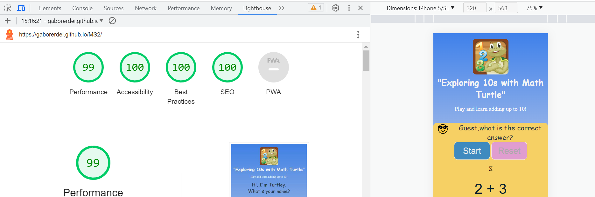
    - This second image is Lighthouse Testing mobile.
    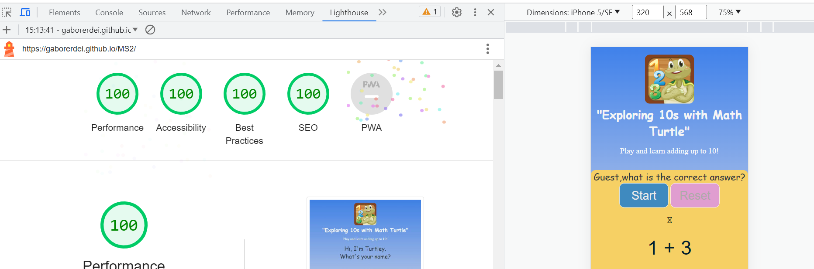

### **Responsiveness**

- The website is responsive to all devices within the ranges specified below.
    - Pixel width :  481px wide and down

### **Manual testing**

- Checked all the buttons during the game. All of them function trouble-free when clicked.

- Log-in input works as well.

- I tested the functionality of the game with my doughter and my other family members. 

 - They like emoji very much and sometimes answers wrong to see the crying   
   emoji. Collecting scores has not a big meaning. Nevertheless he he likes to know how many correct answers he did.

- She has a lot of fun typing his name in the log-in area.

- The gamneinstruction-area (game rules) window opens when the rule icon is clicked. 

### **Bugs**

- Problem 1:  When adding a timer to start the game the timer started fom 28s instead of 30s. (I didn`t find a real solution, but works fine...)
  - *Solution 1: Timer started from 32s in the code in JS file, line 37.*

- Problem 2: When clicking "start-btn" and after "reset-btn" and after "start-btn" again, then the two answer buttons wasn`t disabled.
  - *Solution 2: In the code at the end of "reset-btn" click event added the newRound(); function in line 178.*

- Problem 3:  When I wrote any name in the "Type your name" area and clicked    the "Play with me" button on the game area the user name didn't display only   "Guest".
  - *Solution 4: In the line 25 I've made a spelling mistake and I`ve learned length != lenght, "if (inputElement.value.length > 0)"*
 

- Problem 4:  When I clicked the right answer, then the "crying" emoji was   
  displayed and reversed.
  - *Solution 3: in line 121,122,124 and 125 changed te display "none" and "block" reversed document.getElementById("happy").style.display = "none" or "display"*

#### **Unfixed Bugs**

- Timer start from 32s, but on the screen start from 30s.

### Mistakes

I used onclick Event on my buttons in my HTML file.
    
- *Solution: Instead I used addEventListener() in js file, so the whole code is stored only in js file.*

## Deployment
------
Math with Turtley was deployed onto GitHub Pages. Here are the steps to deploy this website:

- Within the repository name of the project (MS2), go to the ***Settings*** tab
- On the left hand menu, under ***Code and automation*** subtitle see ***Pages***
- Under ***Build and deployment*** and ***Branch*** choose ***Main***, click Save.
- This page will then refresh and the name of the website with live link will be available within a few minutes.
- Find this link [here](https://gaborerdei.github.io/MS2/)

## Credits 
------
### **Code**

- To handle username I used this.
- [manage user name ](https://medium.com/swlh/how-to-create-your-first-login-page-with-html-css-and-javascript-602dd71144f1)

- To play the game the Timer function was needed. I just simply asked the ChatGPT show me a timer in javascript. I looked into the code and simpe applied in my code.

  
  
- Also, I watched the video tutorial from [Dcode](https://www.youtube.com/watch?v=PIiMSMz7KzM), which assisted me in how the timer works.

### **Helpsheets and learning materials**

- Throughout the start of this website build I relied heavily on the tutorials from the Code Institute JavaScript Essentials part. I am very thankful to Anna Greaves, content developer of the Code Institute.

- My best friend Adam assisted me throughout the project development. He helped me to understand how to improve the user experience of the project. Understanding the confusing Java Script syntax at the beginning of the project was not easy for me. Adam cheered me up and motivated me to carry on. I appreciate him contribution to my progress.

- Chosing the design for the buttons I used the next two websites [Codepen](https://codepen.io/) and [Webdeasy.](https://webdeasy.de/top-css-buttons/?utm_content=cmp-true&fbclid=IwAR0_wlgRsKiVloPtwRA7IKqEeEYxZQ31WEMD4tyNR4oiWItjKSKOrfOLh4E)

- [How modal, game rules in my project works](https://getbootstrap.com/docs/5.0/components/modal/#live-demo)

### **Media**

- [Turtley logo image](https://qonversion.io/apps/ios/turtle-math-for-kids-children-learn-numbers-addition-and-subtraction/672641832)

### **Technologies used**

- [Favicon](https://favicon.io/favicon-converter/) Generator 
- [Paint from Windows]() was used to edit images for documentation.
- [Balsamiq](https://balsamiq.com/wireframes/) was used to make wireframes for documentation.
- [Font Awesome](https://fontawesome.com/) for icons.
- [CSS animation](https://www.w3schools.com/css/css3_animations.asp) to style the logo image, logo title and hourglass icon for time display.

## Wireframes
------

    
